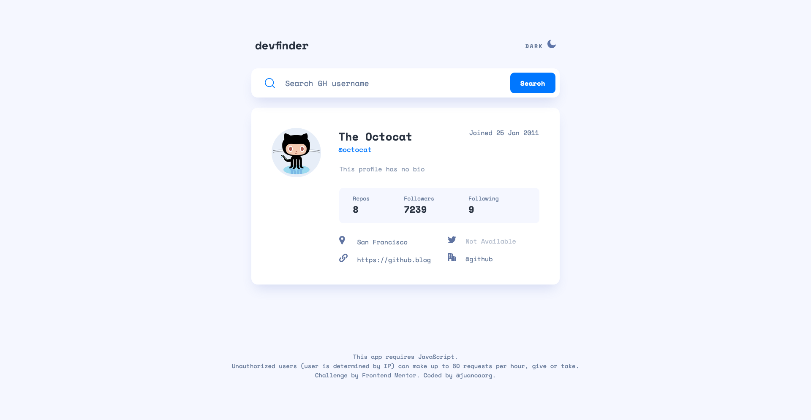
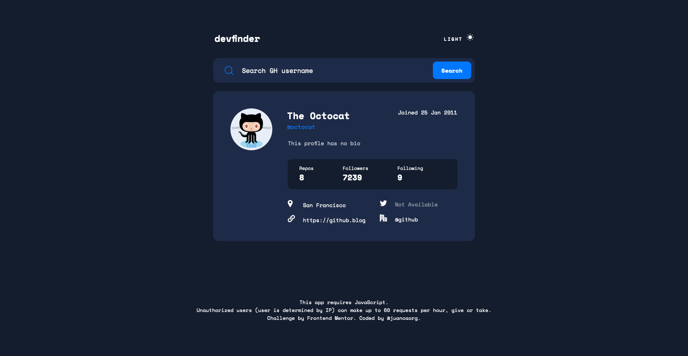

# Frontend Mentor - GitHub User Search

This is a solution to the [GitHub user search app challenge on Frontend Mentor](https://www.frontendmentor.io/challenges/github-user-search-app-Q09YOgaH6). Frontend Mentor challenges help you improve your coding skills by building realistic projects.

## Table of contents

- [Overview](#overview)
  - [The challenge](#the-challenge)
  - [Expected behaviour](#expected-behaviour)
  - [Screenshot](#screenshot)
  - [Links](#links)
- [My process](#my-process)
  - [Built with](#built-with)
  - [What I learned](#what-i-learned)
    - [BEM](#bem)
    - [Safari's `input` problem](#safaris-input-problem)
    - [Changing an SVG color](#changing-an-svg-color)
    - [`KeyboardEvent.keyCode` is deprecated](#keyboardeventkeycode-is-deprecated)
    - [GitHub API limitations](#github-api-limitations)
    - [Dark mode](#dark-mode)
  - [Continued development](#continued-development)
  - [Useful resources](#useful-resources)
- [Author](#author)
- [Acknowledgments](#acknowledgments)

## Overview

### The challenge

Users should be able to:

- View the optimal layout for the app depending on their device's screen size
- See hover states for all interactive elements on the page
- Search for GitHub users by their username
- See relevant user information based on their search
- Switch between light and dark themes
- **Bonus**: Have the correct color scheme chosen for them based on their computer preferences. _Hint_: Research `prefers-color-scheme` in CSS.

### Expected behaviour

- On first load, show the profile information for Octocat.
- Display an error message (as shown in the design) if no user is found when a new search is made.
- If a GitHub user hasn't added their name, show their username where the name would be without the `@` symbol and again below with the `@` symbol.
- If a GitHub user's bio is empty, show the text "This profile has no bio" with transparency added (as shown in the design). The lorem ipsum text in the designs shows how the bio should look when it is present.
- If any of the location, website, twitter, or company properties are empty, show the text "Not Available" with transparency added (as shown in the design).
- Website, twitter, and company information should all be links to those resaources. For the company link, it should remove the `@` symbol and link to the company page on GitHub. For Octocat, with `@github` being returned for the company, this would lead to a URL of `https://github.com/github`.

### Screenshot




### Links

- Solution URL: [GitHub Repository](https://github.com/juancaorg/github-user-search)
- Live Site URL: [githubusersearch.juanca.dev](https://githubusersearch.juanca.dev/)

## My process

### Built with

- Semantic HTML5 markup
- CSS custom properties
- Flexbox
- Mobile-first workflow
- Vanilla JavaScript

### What I learned

This was a really complete project where I learned a bunch of stuff, so I'll divide it in the following subsections.

#### BEM

In previous projects I tried to implement this convention for my CSS, but I haven't read anything as concise to really understand it.

I think I did a pretty decent job implementing it in this project.

TL;DR. BEM syntax conventions:

- Use one or two underscores to separate the block name from the element name.
- Use one or two dashes to separate the element name and its modifier.
- Use descriptive class names in **camelCase**.

#### Safari's `input` problem

Safari didn't adhere to my submit button (<input type="submit" />) style on iOS.

It seems like it's been a problem with Safari since 2009. It has been fixed on macOS, but not iOS, which has more active users in general.

To fix it, add the following CSS:

```css
input {
  -webkit-appearance: none;
  -moz-appearance: none;
  appearance: none;
}
```

Now all your input elements (like <input type="submit" />) should work correctly on Safari iOS.

Waiting for Apple to fix this, tho 💀.

#### Changing an SVG color

For now, you can't change the color of an SVG as easily as changing the color of a font (just using something like `color: red`). You have to use `filter`.

First, add the SVG image using an  tag. For example:

```html

```

Second, to filter to a specific color, use the following [codepen](https://codepen.io/sosuke/pen/Pjoqqp) to convert a hex color code to a CSS filter (you may need to run it more than one time for precision sake):

For example, output for `#00EE00` is:

```css
filter: invert(42%) sepia(93%) saturate(1352%) hue-rotate(87deg) brightness(
    119%
  ) contrast(119%);
```

Finally, add the CSS `filter` to your SVG class:

```css
.filter-green {
  filter: invert(48%) sepia(79%) saturate(2476%) hue-rotate(86deg) brightness(
      118%
    ) contrast(119%);
}
```

#### `KeyboardEvent.keyCode` is deprecated

I have been using `.keyCode` for detecting specific keys, now you can use an easier to read `.key` property.

For instance if you want to detect whether the "Enter"-key was clicked or not:

Instead of using:

```javascript
event.keyCode === 13;
```

Do it like:

```javascript
event.key === "Enter";
```

#### GitHub API limitations

When working with the GitHub API, at the beginning, everything was smooth sailing until I ran into a `403` error after playing with the API for a while.

Basically, if you are an unauthorized user (basically, if you don't login using your GitHub account) **you can make up to 60 requests per hour based on your current IP**, give or take.

I get it, this API isn't mine and I should have read the docs in more detail. Oh well, the more your know.

#### Dark mode

My first time implementing a dark mode and a dark mode toggle into an app and now I get why most MVPs don't implement one.

It's _really cumbersome_.

Nothing out of the world, but if you are going to implement multiple interations soon to your UI, don't even bother.

Anyway, if your want to implement it _automatically_ by reading the user's OS preference, just use the `prefers-color-scheme` media query. This is pretty easy.

A small example:

```css
:root {
  --body-bg: #fafafa;
  --body-color: #555;
  --link-color: #222;
  --link-color-hover: #000;
}

@media (prefers-color-scheme: dark) {
  :root {
    --body-bg: #212529;
    --body-color: #6c757d;
    --link-color: #dee2e6;
    --link-color-hover: #fff;
  }
}
```

If you want to implement a _manual_ toggle, which this project needed, I decided to add a `.dark` class to each section that needed it and add it or remove it when toggling. Not going in depth, but I have to admit that I didn't enjoy implementing it this way.

### Continued development

As mentioned before, I think that implementing a vanilla dark mode toggle can be cumbersome and I still have a lot to learn.

References that I'll have to read in more detail and can be helpful for future dark mode projects:

- [CSS dark mode](https://markdotto.com/2018/11/05/css-dark-mode/) by @mdo.
- [Light and dark mode in just 14 lines of CSS](https://whitep4nth3r.com/blog/quick-light-dark-mode-css/) by @whitep4nth3r.
- [prefers-color-scheme: Hello darkness, my old friend](https://web.dev/prefers-color-scheme/) by Thomas Steiner.
- [Redesigning your product and website for dark mode](https://stuffandnonsense.co.uk/blog/redesigning-your-product-and-website-for-dark-mode) by Andy Clarke.
- [Dark Mode in CSS](https://css-tricks.com/dark-modes-with-css/) by Robin Rendle.
- [A Complete Guide to Dark Mode on the Web](https://css-tricks.com/a-complete-guide-to-dark-mode-on-the-web/) by Adhuham.

Other stuff that should be fixed later:

- The icon opacity issue when data display "Not Available".
- Desktop view with long names (maybe slice it like the profile URL).
- Dark mode toggle doesn't read the OS preference after the first load.

### Useful resources

- [What is BEM in CSS?](https://whitep4nth3r.com/blog/what-is-bem-in-css/) - Learn the convention on how to encapsulate your style rules in a systematic way so that they apply to one particular chunk of HTML only.
- [CSS filter generator to convert from black to target hex color](https://codepen.io/sosuke/pen/Pjoqqp) - The page to convert an hex color to a CSS `filter` to change an SVG color.
- [Tips for Aligning Icons to Text](https://css-tricks.com/tips-aligning-icons-text/).
- [How to change the color of an svg element?](https://stackoverflow.com/questions/22252472/how-to-change-the-color-of-an-svg-element).
- [How to make a color white using filter property in CSS](https://stackoverflow.com/questions/52829623/how-to-make-a-color-white-using-filter-property-in-css#52829710).
- [css - placeholder text color on firefox](https://stackoverflow.com/questions/19621306/css-placeholder-text-color-on-firefox).
- [CSS: Safari on Mac doesn't adhere to my Submit Button style](https://stackoverflow.com/questions/1681826/css-safari-on-mac-doesnt-adhere-to-my-submit-button-style).
- [KeyboardEvent.keyCode deprecated. What does this mean in practice?](https://stackoverflow.com/questions/35394937/keyboardevent-keycode-deprecated-what-does-this-mean-in-practice).
- [Dark mode switch with prefers-color-scheme: dark](https://stackoverflow.com/questions/61899858/dark-mode-switch-with-prefers-color-scheme-dark#61900120).
- [How to override css prefers-color-scheme setting](https://stackoverflow.com/questions/56300132/how-to-override-css-prefers-color-scheme-setting)

## Author

- Website - [juanca.org](https://www.juanca.org)
- Frontend Mentor - [@juancaorg](https://www.frontendmentor.io/profile/juancaorg)
- Twitter - [@juancaorg](https://twitter.com/juancaorg)

## Acknowledgments

Every single developer, engineer and designer that posted the above links sharing their knowledge to the world wide web.

Also, special shoutout to [@mightycoyote](https://github.com/mightycoyote) GitHub user search app [solution](https://github.com/mightycoyote/github-user-search-app) that served me as a reference when I got stuck building my own dark mode toggle.
